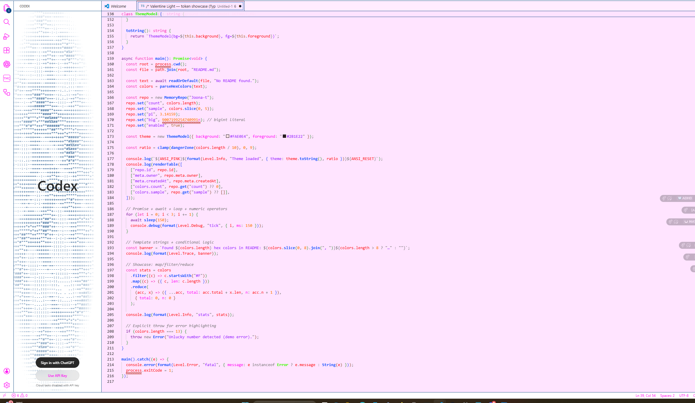
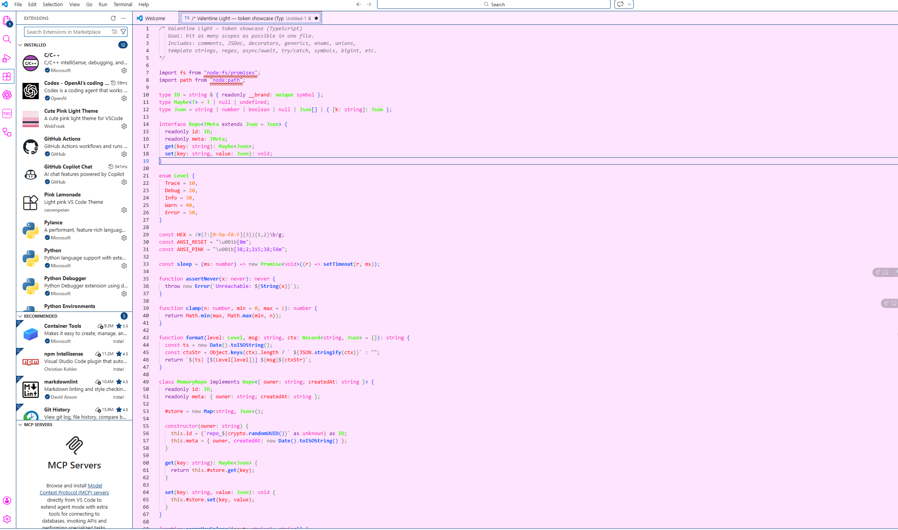

# Valentine Light 🌸

A high-contrast pastel blush theme for Visual Studio Code.

Designed for clarity, softness, and long coding sessions without eye fatigue.

---

## ✨ Features

- Light high-contrast UI
- Soft blush background
- Clear keyword separation
- Calm but readable comment styling
- Balanced saturation for long sessions

---

## 📸 Screenshots

### TypeScript Showcase

### Python Showcase

---

## 🚀 Installation

1. Open **Extensions** in VS Code  
2. Search for **Valentine Light**  
3. Click **Install**  
4. Open Command Palette → `Preferences: Color Theme`  
5. Select **Valentine Light**

---

Built with care by Joona-t.
